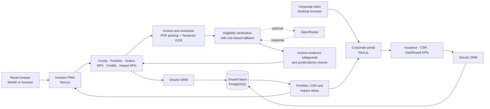

# GreeFin

### Green finance, made accessible—and accountable.

GreeFin is a sustainable-finance platform that connects everyday investors with green infrastructure while giving corporates tools to issue green investment products, allocate CSR funding, and track environmental impact indicators.

The project supports **UN Sustainable Development Goal 9: Industry, Innovation and Infrastructure** by widening access to sustainable infrastructure financing.

[Investor demo](https://greefin.vercel.app/) ·

## The problem

Green infrastructure needs long-term capital, but retail investors often have limited access to these opportunities. At the same time, corporate sustainability and CSR funding can be difficult to connect to visible outcomes.

GreeFin brings both sides into one connected experience: investors can explore green financial products and follow their portfolio and impact, while corporates can issue products, allocate CSR funds, and track how those funds are used.

## The product

### Investor PWA

- Discover green mutual funds, bonds, and InvITs.
- Explore portfolio holdings, returns, orders, SIPs, and a watchlist.
- Earn Green Credits worth 5% of an investment and view environmental impact indicators.
- Submit a green-purchase claim with an invoice. OCR extracts invoice text; product and price checks compare the evidence with the claim, with AI-assisted eligibility review when configured.

### Corporate portal

- Create and manage green bonds and InvIT listings for investors to discover.
- Allocate CSR funding to support Green Credit redemptions.
- Review allocations, redemptions, investment activity, and impact indicators from a corporate dashboard.

The portals share fund, CSR, and redemption data, connecting a corporate-issued product to investor activity and the CSR redemption loop.

## Architecture

## Technology

| Layer | Technology |
| --- | --- |
| Investor experience | Next.js, React, TypeScript, Tailwind CSS, PWA support |
| Corporate experience | Next.js, React, TypeScript, Tailwind CSS |
| API and application logic | Next.js Route Handlers |
| Data | Neon PostgreSQL with Drizzle ORM |
| Invoice evidence | `pdf-parse`, Tesseract.js, deterministic product and amount checks |
| AI-assisted review | OpenRouter, when an API key is configured |

## Prototype scope

GreeFin is a hackathon prototype. Demo investor and corporate identities are used, and investment orders are simulated; it is not a brokerage, payment service, or investment-advice product. Impact figures and issuer information should be treated as prototype data, not independently verified real-world outcomes.
